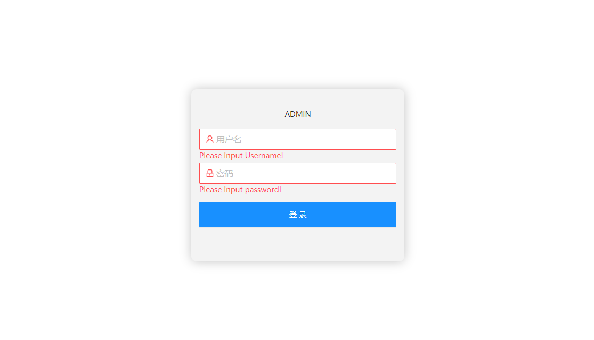
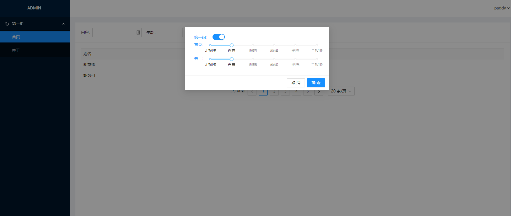

# umi project
> 基于React快速成型后台系统，缓存API请求数据，节省资源并能提高访问速度，包含后台常用的页面组件以及独特的权限控制技术。

## Getting Started

```bash
$ yarn dev
```

## Components

> 包含了以下后台系统常用的一系列组件.

- Menu 菜单组件
- Form 表单组件
- Table 列表组件
- Permission 权限设置

## View

